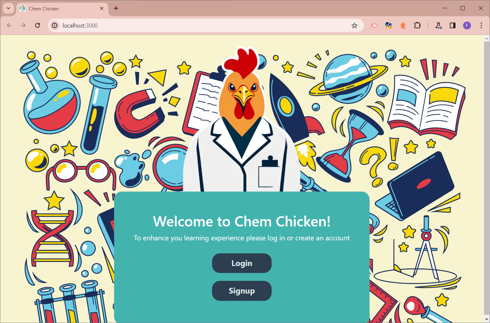
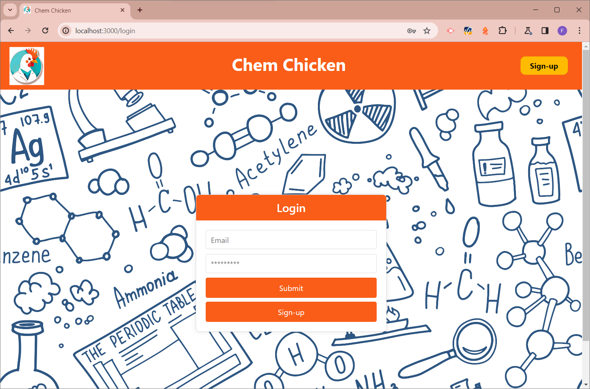
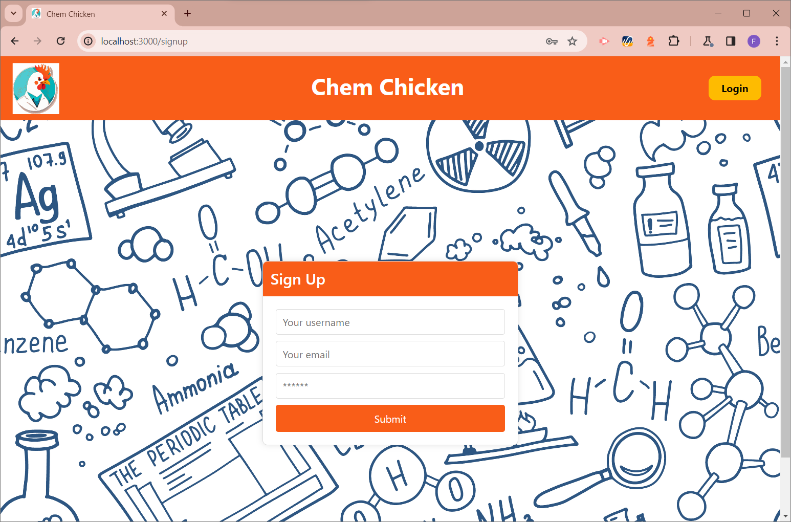
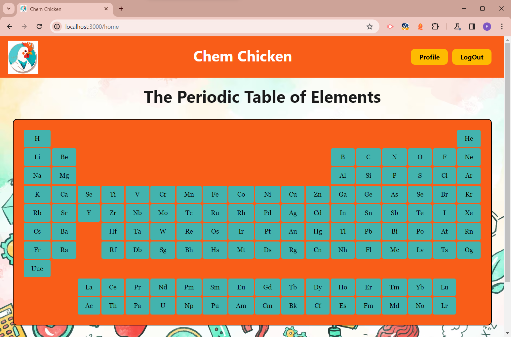

# Chem Chicken 

...where learning chemistry becomes an adventure for young minds!

## Contributors

- [Bruno Medina](https://github.com/Quebvihn)
- [Frieda Fry](https://github.com/FriedaHF)
- [Yasin Hubbard](https://github.com/Hubbard1118)

## Screenshots

    Welcome to Chem Chicken!

    How about we log in ---

    --- or sign up!

    Home Page ---

    For a more in-depth view of the page --- ⬇️

## Website

[Deployed Website](https://chem-chicken.onrender.com/home)

[Repository](https://github.com/Hubbard1118/chemChicken)

## Acknowledgements
- Supportive links provided by Teacher's Assistant [Mary Elenius](https://github.com/404pandas)

- Helpful links found on the WEB

## License

This project is licensed under the **MIT license**.

## Technologies

